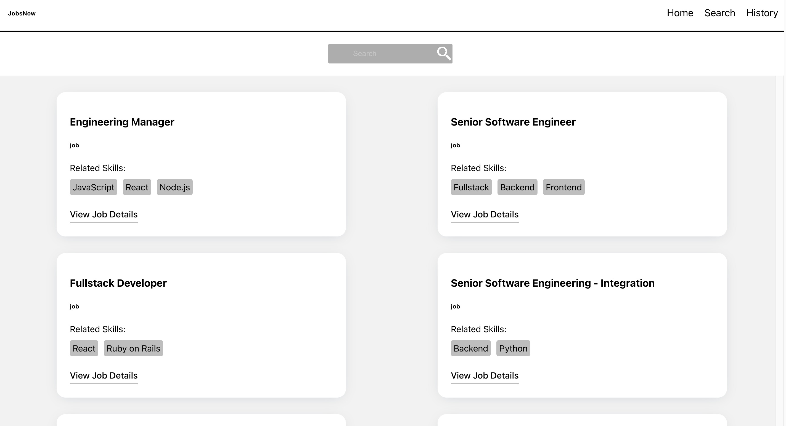
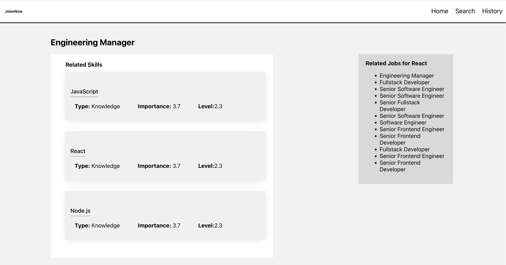
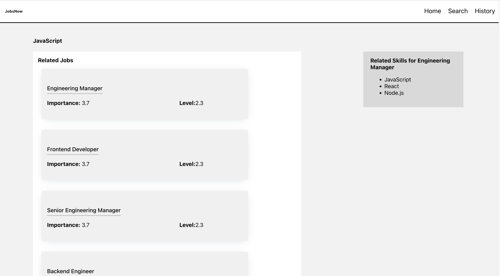

# Job Search Application

<div id="top"></div>


## About The Project

A web application for Listing Jobs , searching through jobs Api with search history and allows users to view jobs and skills..

### Features

- Jobs Listing
  
-  Jobs Search with Search History
  
- Skills listing For each job 
  
- Job listing for every skill
  

### Built With

- React
- ReactRouter
- Sass

<p align="right">(<a href="#top">back to top</a>)</p>

<!-- GETTING STARTED -->

## Getting Started

> To get a local copy, follow these simple steps :
### Installation
#### installing Locally
1. Clone the repo

  ```sh
   git clone https://github.com/SalmaaOsamaa/JobSearchApplication.git
   ```
   2. go to project folder

   ```sh
   cd wuzzuf-task
   ```
3. install dependencies & start

   ```bash
   npm install
   ```

   4. start the project

   ```sh
   npm start
   ```
 5. To run tests

```sh
   npm run test 
   ```